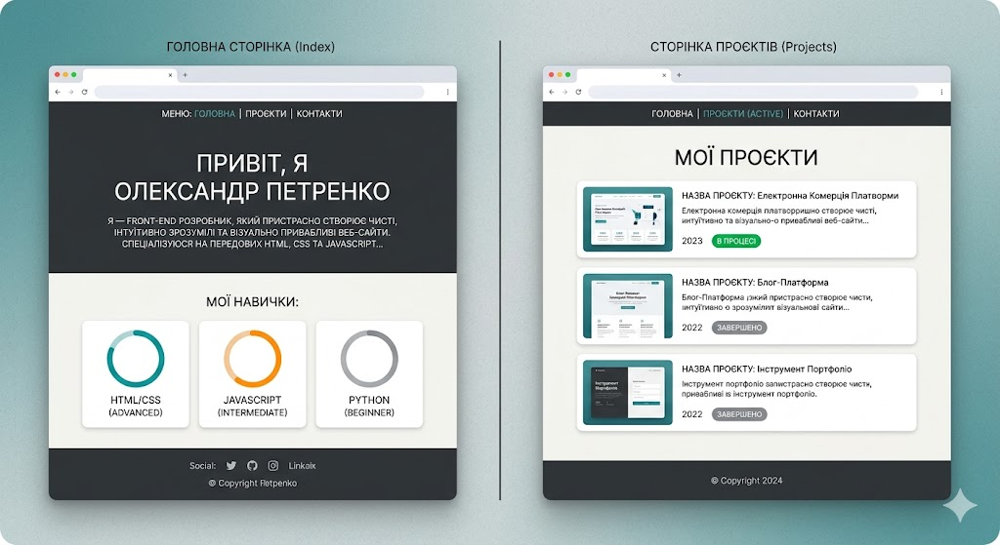
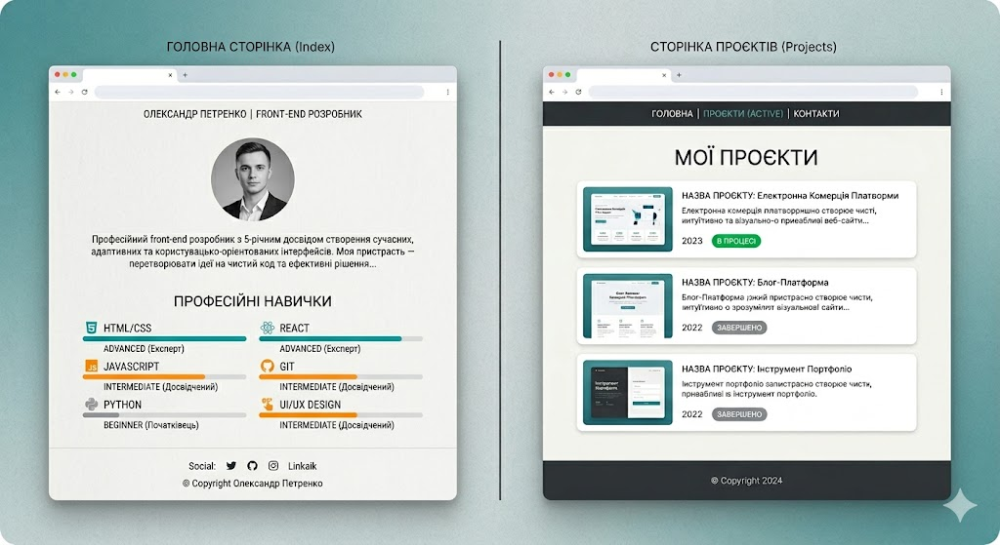

`Домашня робота №7`

## Робота з View, шаблонами та роутингом

Створити персональний сайт-портфоліо, використовуючи фреймворк Django. 
 

Приклади згенеровані за допомогою https://gemini.google.com/

Має бути реалізовано 3 сторінки: `Головна`, `проєкти` та `контакти`.

`Головна сторінка`: ім'я, коротке біо, список навичок з рівнями (beginner / intermediate / advanced) — кожен рівень відображається іншим кольором. 
 
`Сторінка проєктів`: список із назвою, описом, роком, статусом. 

`Сторінка контактів`: інформація про те, як можна з вами зв'язатися.
 
Навігація і футер — через base.html. Підключити власний CSS.

---

    У MyStat потрібно завантажити код (у вигляді скриншотів або тексту) та скріншоти/відео виконання програми.

---