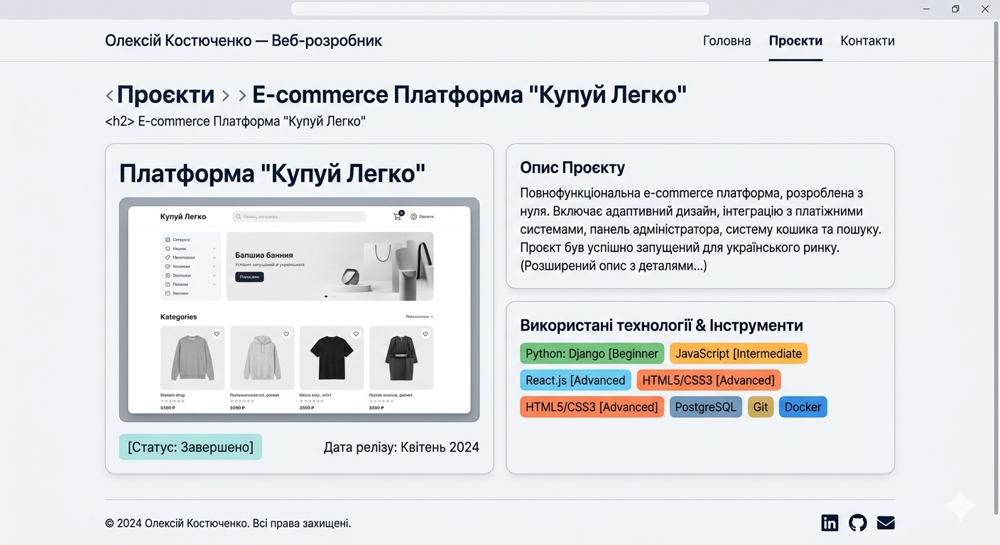

`Домашня робота №8`

## Параметри url та запитів

На сайті-портфоліо, створеному у попередньому домашньому завданні, додати можливість детально переглядати інформацію про проєкти.

При натисканні на блок проєкту має відкриватися окрема сторінка, присвячена цьому проєкту. Для всіх проєктів використати один `view` та один маршрут з параметром, за допомогою якого ідентифікувати проєкти.

Наприклад, для запиту `/projects/2` має відкритися сторінка з подробицями про проєкт з ID = 2.
 

Приклад згенеровано за допомогою https://gemini.google.com/

> Детальніше про те, як це реалізувати: 
> 
> [Уроки](/5_Django/Lessons/) / [Роутинг та робота з URL](/5_Django/Lessons/3_Routing.md)

---

    У MyStat потрібно завантажити код (у вигляді скриншотів або тексту) та скріншоти/відео виконання програми.

---