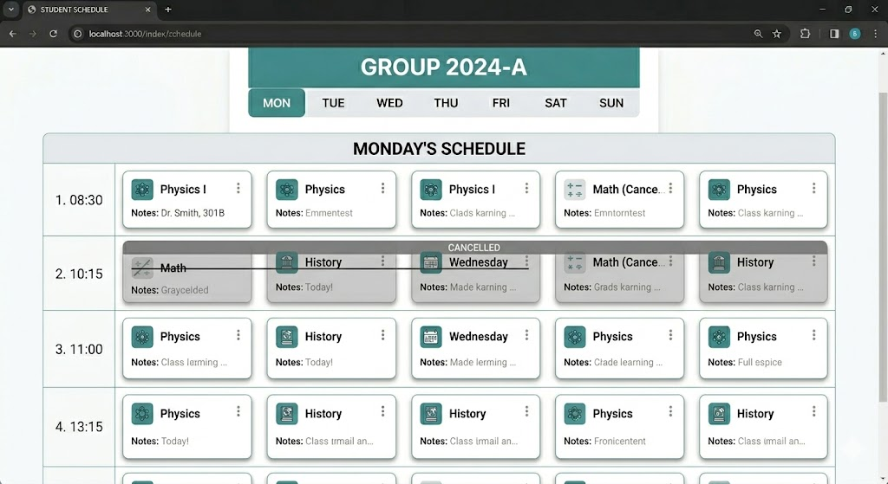
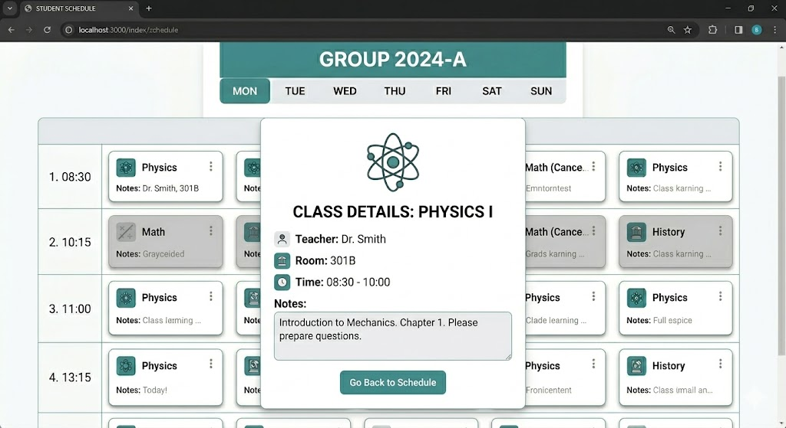
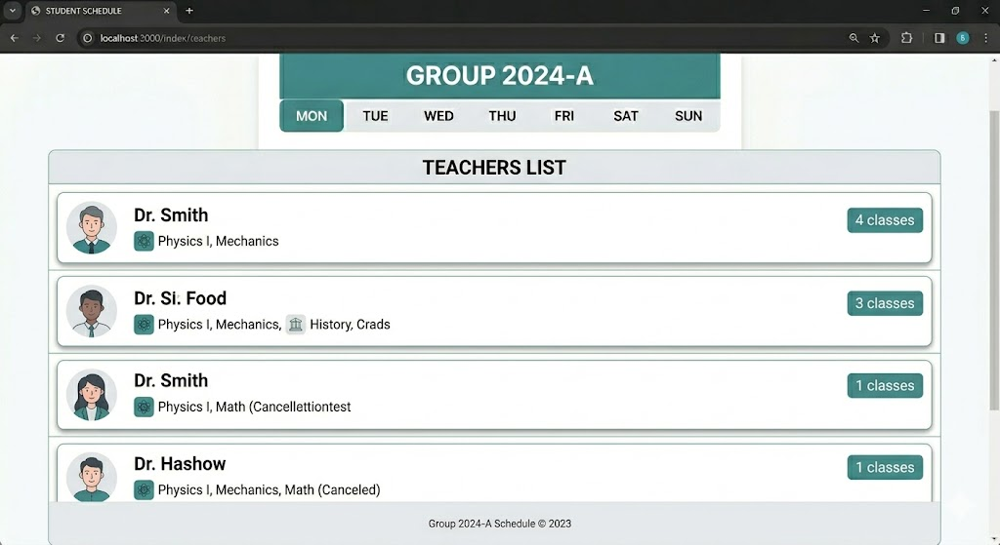

`Домашня робота №9`

## Міні-проєкт "Розклад занять"

Реалізувати сайт із розкладом для студентської групи.

### Перелік сторінок:

1. **Головна сторінка** — назва групи, поточний тиждень (передати рядком у контекст), швидкі посилання на кожен день

Приклад згенеровано за допомогою https://gemini.google.com/
---
2. **Сторінка розкладу на тиждень** — всі дні та пари у вигляді таблиці. Скасовані пари (`is_cancelled: True`) — закреслені та сірі. `forloop.counter` для нумерації пар

Приклад згенеровано за допомогою https://gemini.google.com/
---
3. **Сторінка конкретного дня** за `<str:day>` (наприклад `/schedule/monday/`) — лише пари цього дня, якщо пар немає — «Вихідний»

Приклад згенеровано за допомогою https://gemini.google.com/
---
4. **Сторінка деталей пари** за `<int:pk>` — предмет, викладач, аудиторія, час, нотатки

Приклад згенеровано за допомогою https://gemini.google.com/
---
5. **Сторінка «Викладачі»** — список викладачів із предметами (`join:", "`) та кількістю пар.

Приклад згенеровано за допомогою https://gemini.google.com/

### Вимоги

Дані мають зберігатися у базі даних. Додати перевірку на коректність дня тижня для сторінки конкретного дня.

### Додатково

Додати у Master-шаблон side bar з виведенням сьогоднішнього розкладу (за днем тижня) та поточним заняттям (визначати за поточним часом).

> Детальніше про те, як використовувати базу даних: 
> 
> [Уроки](/5_Django/Lessons/) / [Моделі та ORM](/5_Django/Lessons/4_Models.md)

---

    У MyStat потрібно завантажити код (у вигляді скриншотів або тексту) та скріншоти/відео виконання програми.

---