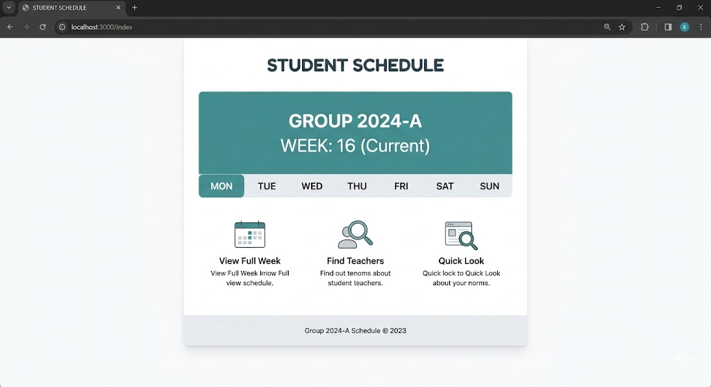
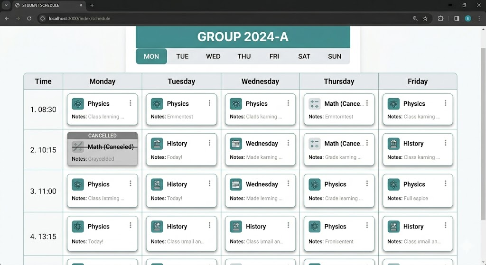

`Практична робота`

## Розклад занять

Реалізувати сайт із розкладом для студентської групи.

### Перелік сторінок:

1. **Головна сторінка** — назва групи, поточний тиждень (передати рядком у контекст), швидкі посилання на кожен день

---
2. **Сторінка розкладу на тиждень** — всі дні та пари у вигляді таблиці. Скасовані пари (`is_cancelled: True`) — закреслені та сірі. `forloop.counter` для нумерації пар

---
3. **Сторінка конкретного дня** за `<str:day>` (наприклад `/schedule/monday/`) — лише пари цього дня, якщо пар немає — «Вихідний»

---
4. **Сторінка деталей пари** за `<int:pk>` — предмет, викладач, аудиторія, час, нотатки

---
5. **Сторінка «Викладачі»** — список викладачів із предметами (`join:", "`) та кількістю пар.

### Вимоги

Дані зберігати в окремому файлі у вигляді списку/словників. Додати перевірку на коректність дня тижня для сторінки конкретного дня.

### Додатково

Додати у Master-шаблон side bar з виведенням сьогоднішнього розкладу (за днем тижня) та поточним заняттям (визначати за поточним часом).